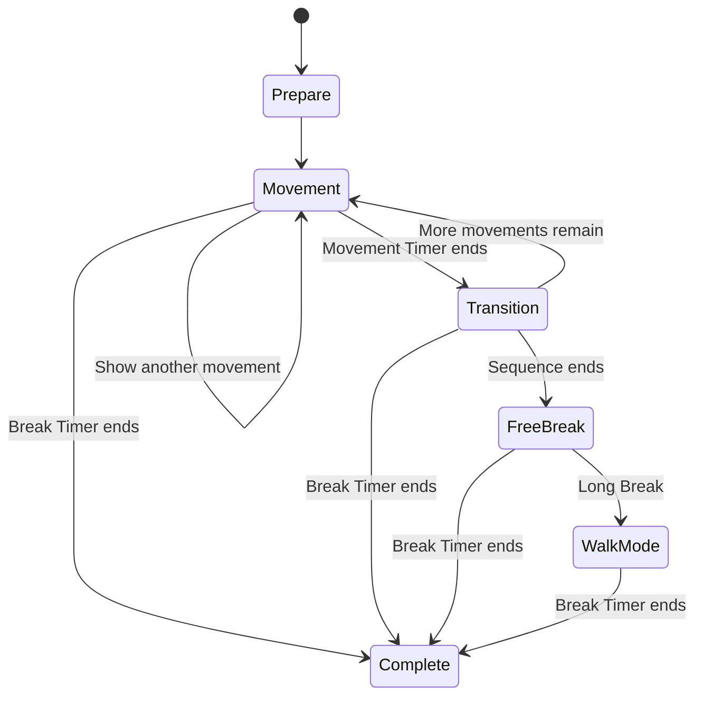

# Design Document: BreakShield Movement Guidance

## Overview

Pomohardo uses BreakShield to enforce a Short Break or a Long Break. BreakShield currently shows the Break Timer and a fixed message. This feature adds optional Movement Guidance to BreakShield.

Movement Guidance shows a safe movement, a visual guide, a short instruction, and a Movement Timer. The Break Timer continues to show the total time that remains. A Short Break uses a short guided sequence. A Long Break recommends a walk and does not keep the user at the screen.

This feature supports a break. It does not measure exercise performance. It does not give medical treatment.

## Glossary

- **Pomohardo**: The application that manages work sessions and enforced breaks.
- **BreakShield**: The full-screen Pomohardo window that blocks input during a break.
- **Short Break**: The break that follows a normal Work session.
- **Long Break**: The longer break that follows the configured number of Work sessions.
- **Break Timer**: The countdown for all remaining break time.
- **Movement Guidance**: The optional BreakShield content that explains one movement at a time.
- **Movement**: One gentle physical action in a guided sequence.
- **Movement Timer**: The countdown for the current Movement.
- **Guided Sequence**: An ordered set of Movements and transitions.
- **Walk Mode**: The Long Break state that asks the user to leave the workstation and walk.
- **Visual Guide**: A static or animated illustration that shows how to do a Movement.
- **Reduced Motion**: An operating-system preference that asks applications to limit animation.
- **Emergency Skip**: The existing controlled action that ends a break before the Break Timer ends.

## Goals

- Help the user change posture during a Short Break.
- Help the user leave the workstation during a Long Break.
- Give clear instructions without a required setup process.
- Show safe, quiet Movements that need no special clothes or floor contact.
- Keep the existing BreakShield enforcement and Emergency Skip behavior.
- Support users who cannot do a selected Movement.
- Support Reduced Motion and screen-reader use.

## Non-goals

- Detect whether the user does a Movement.
- Count steps or repetitions.
- Use a camera, microphone, or wearable device.
- Diagnose pain or an injury.
- Replace advice from a qualified health professional.
- Provide a complex Movement editor in the first release.
- Require Movement Guidance before a break can continue.

## User Experience

### Common BreakShield layout

BreakShield shows these items during Movement Guidance:

1. The break type and Break Timer.
2. The Visual Guide.
3. The Movement name and Movement Timer.
4. One short primary instruction.
5. One short safety instruction when it is necessary.
6. A **Show another movement** action.

The **Show another movement** action replaces the current Movement. It does not stop or reduce the Break Timer. It does not use an Emergency Skip.

The Break Timer is the primary timer. The Movement Timer is smaller. A transition between Movements lasts 5 to 10 seconds. The transition screen shows the name of the next Movement.

### Short Break

The Short Break helps the user stop a static posture and rest the eyes.

Default flow for a five-minute Short Break:

1. Show a 10-second preparation state.
2. Show two or three gentle Movements.
3. Show each Movement for 30 to 45 seconds.
4. Use a 5 to 10-second transition between Movements.
5. Use the remaining time for eye rest, water, or a short walk.

The default Movement Mode is **Mixed**. The sequence can contain a seated Movement and a quiet standing Movement.

If less than two minutes remain, BreakShield does not start a new full Guided Sequence. It shows one Movement or the normal rest message.

### Long Break

The Long Break helps the user leave the workstation. Walk Mode is the default Long Break experience.

Default flow:

1. Optionally show one gentle warm-up for 30 to 60 seconds.
2. Show the message: **Take a short walk. Come back when the timer ends.**
3. Dim the screen.
4. Keep the Break Timer visible.
5. Play the configured end sound when the Break Timer reaches zero.
6. Wait for user input before Pomohardo starts the next Work session.

The user can select a Guided Sequence instead of Walk Mode. A Long Break Guided Sequence lasts 3 to 5 minutes. It does not fill the full Long Break. After the sequence, BreakShield enters Walk Mode.

BreakShield does not require the user to confirm a walk. It does not track the user.

### Break completion

When the Break Timer reaches zero, BreakShield stops Movement Guidance and animation. It shows the existing break-complete state. The configured end sound helps a user who is away from the screen.

The next Work session does not start until the user returns and gives the existing completion input.

## Visual Guide

### Format

Each Movement has these visual assets:

- A start-position image.
- An end-position image.
- Optional animation metadata.
- Alternative text that describes the Movement.

The first implementation uses two WebP images with a controlled frame change or crossfade. Animated WebP can be evaluated later. GIF is only a fallback format.

The application controls animation because this gives pause control and Reduced Motion support. The animation uses a slow 2 to 4-second loop. It pauses at the start and end positions.

When Reduced Motion is active, BreakShield shows the start and end images side by side. It does not animate them.

### Illustration rules

- Use a simple illustration, not a photograph.
- Use the same person, camera angle, colors, and background for all Movements.
- Show all body parts that are necessary to understand the Movement.
- Use one simple arrow only when it improves clarity.
- Do not put instruction text in an image.
- Do not use flashing content or fast motion.
- Do not show unsafe furniture or an unstable support.
- Use high contrast against the BreakShield background.

Images must be available locally. BreakShield must not download an image when a break starts. The application preloads the assets before it shows BreakShield.

## Initial Movement Library

The first release uses a small reviewed library.

Recommended default Movements:

- Look away from the screen.
- Chin tuck without hand pressure.
- Shoulder-blade squeeze.
- Gentle wrist movement in a comfortable range.
- Seated gentle back movement.
- Calf raise with optional stable support.
- Walk in place.

Do not include these Movements in the default library before a qualified reviewer approves them:

- A neck pull that uses hand pressure.
- A strong spinal twist.
- A forceful wrist stretch.
- A hover squat near a movable chair.
- A deep lunge in a small work area.

## Movement Selection

The selection system uses these inputs:

- Break type.
- Movement Mode.
- Intensity.
- Available break time.
- Movements that the user rejected during the current break.
- The recent Movement history.

The selector does not repeat a Movement until it has used the other eligible Movements. **Show another movement** adds the current Movement to a temporary reject list for the current break.

If no eligible Movement remains, BreakShield shows the normal rest message. The Break Timer continues.

## Settings

The first release adds these settings:

- **Movement guidance**: On or Off. Default: On.
- **Short Break guidance**: On or Off. Default: On.
- **Long Break guidance**: Walk, Guided start, or Off. Default: Walk.
- **Movement Mode**: Seated, Standing, or Mixed. Default: Mixed.
- **Intensity**: Gentle or Normal. Default: Gentle.
- **Movement illustrations**: On or Off. Default: On.
- **Movement sound**: On or Off. Default: Off.
- **Long Break end sound**: On or Off. Default: On.

Pomohardo does not ask the user to select individual Movements during initial setup. A later release can add exclusions for a body area or a specific Movement.

## Data Model

The persisted configuration needs these fields:

```rust
pub struct MovementGuidanceConfig {
    pub enabled: bool,
    pub short_break_enabled: bool,
    pub long_break_mode: LongBreakGuidanceMode,
    pub movement_mode: MovementMode,
    pub intensity: MovementIntensity,
    pub illustrations_enabled: bool,
    pub movement_sound_enabled: bool,
    pub long_break_end_sound_enabled: bool,
}

pub enum LongBreakGuidanceMode {
    Walk,
    GuidedStart,
    Off,
}

pub enum MovementMode {
    Seated,
    Standing,
    Mixed,
}

pub enum MovementIntensity {
    Gentle,
    Normal,
}
```

Each library entry needs this information:

```text
id
name
primary_instruction
safety_instruction
alternative_text
mode: seated | standing
intensity: gentle | normal
duration_seconds
start_image
end_image
body_areas
requires_stable_support
```

Movement library content can be a local JSON file. Configuration remains in the existing Pomohardo configuration file.

## State Model

Movement Guidance has these states:



The Break Timer owns break completion. A Movement state cannot extend, shorten, pause, or complete a break.

## Accessibility

- Honor the operating-system Reduced Motion preference.
- Provide alternative text for each Visual Guide.
- Keep all instructions as selectable interface text, not image text.
- Do not use color as the only state indicator.
- Keep sufficient text and control contrast.
- Provide a visible animation pause control.
- Preserve keyboard access when the platform input-blocking model permits it.
- Keep instructions short and use direct verbs.
- Do not play Movement sounds when sound is disabled.

## Safety and Content Review

Each Movement must have a content review before release. The review must verify the illustration, instruction, duration, required space, support needs, and stop conditions.

BreakShield shows a short general notice in Settings:

> Move only in a comfortable range. Stop if you feel pain, numbness, or dizziness. Ask a qualified health professional for advice when you have an injury or a medical condition.

A Movement instruction must not claim that it prevents, treats, or cures a condition. It must not tell the user to hold their breath. It must not use forceful language for a stretch.

## Privacy and Network Use

- Movement Guidance does not use a camera or microphone.
- Movement Guidance does not collect motion, health, or exercise data.
- Visual Guide assets ship with the application.
- Movement Guidance works without a network connection.
- Movement selection history stays local.

## Failure Behavior

- If an image fails to load, show the text instruction and Movement Timer.
- If the Movement library fails to load, show the existing BreakShield rest message.
- If audio fails, continue the break without audio.
- If the selected mode has no eligible Movement, show the existing rest message.
- A Movement Guidance failure must not stop BreakShield or input blocking.
- Emergency Skip must continue to work in all Movement Guidance states.

## First Release Scope

The first release contains:

- Seven reviewed Movements.
- Start and end WebP images for each Movement.
- A Short Break Guided Sequence.
- Long Break Walk Mode.
- An optional guided start for a Long Break.
- A Break Timer and Movement Timer.
- Automatic Movement rotation.
- **Show another movement**.
- Reduced Motion behavior.
- Local settings and local assets.
- A Long Break end sound.

The first release does not contain:

- GIF as the primary animation format.
- A custom Movement editor.
- User-uploaded images.
- Movement completion tracking.
- Step counting.
- Camera-based posture analysis.
- Cloud synchronization.

## Acceptance Criteria

1. When a Short Break starts and guidance is on, BreakShield shows a Guided Sequence.
2. The Break Timer remains visible during all Movement Guidance states.
3. The Movement Timer does not change the Break Timer.
4. When the user selects **Show another movement**, BreakShield replaces the Movement without a break-time change.
5. When a Long Break starts in Walk Mode, BreakShield asks the user to walk and then dims the screen.
6. When a Long Break starts in Guided Start mode, BreakShield finishes a 3 to 5-minute sequence and then enters Walk Mode.
7. When Reduced Motion is active, no Movement animation plays.
8. When illustrations are off or unavailable, text instructions remain usable.
9. When the Break Timer reaches zero, Movement Guidance stops and the existing break-complete flow starts.
10. Movement Guidance does not change Emergency Skip behavior or input blocking.

## Open Decisions

- Select the final illustration style and character appearance.
- Select the seven Movement durations after content review.
- Decide whether the Long Break end sound uses the existing notification system or a new bundled sound.
- Decide whether Pomohardo stores recent Movement history across application restarts.
