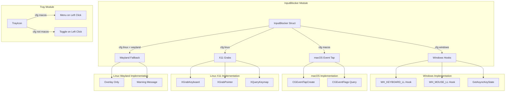

# Design Document: Cross-Platform Compatibility

## Overview

This design addresses cross-platform compatibility gaps in Pomohardo, ensuring feature parity for input blocking and emergency chord functionality across Windows, macOS, and Linux. The implementation leverages platform-specific APIs through Rust's conditional compilation system.

**Current State:**
- Linux (X11): Full implementation using XGrabKeyboard/XGrabPointer
- Linux (Wayland): Limited - overlay only, no global input blocking (by design)
- Windows: Placeholder implementations (prints to console)
- macOS: Placeholder implementations (prints to console)

**Target State:**
- All platforms have functional input blocking during breaks (where technically possible)
- Linux Wayland: Graceful degradation with clear user messaging
- All platforms support emergency chord (Ctrl+Alt+Shift+E) detection
- macOS follows platform conventions for tray icon behavior
- Icon generation scripts work cross-platform

**Wayland Limitations:**
Wayland's security model intentionally prevents applications from:
- Grabbing global keyboard/mouse input
- Intercepting input events destined for other applications
- Reading global key state

This is a fundamental design decision in Wayland, not a missing feature. The application handles this by:
1. Detecting Wayland session via `XDG_SESSION_TYPE` environment variable
2. Logging a warning to inform users of the limitation
3. Relying on the fullscreen overlay (BreakShield) as the primary break enforcement mechanism
4. Suggesting users switch to X11 session for full input blocking

## Architecture



## Components and Interfaces

### 1. InputBlocker Struct Extensions

The `InputBlocker` struct needs platform-specific state fields:

```rust
pub struct InputBlocker {
    active: Arc<AtomicBool>,
    #[cfg(target_os = "linux")]
    x11: Option<X11GrabState>,
    #[cfg(target_os = "windows")]
    windows: Option<WindowsHookState>,
    #[cfg(target_os = "macos")]
    macos: Option<MacOSEventTapState>,
}
```

### 2. Windows Hook State

```rust
#[cfg(target_os = "windows")]
struct WindowsHookState {
    keyboard_hook: HHOOK,
    mouse_hook: HHOOK,
}
```

**API Usage:**
- `SetWindowsHookExW(WH_KEYBOARD_LL, callback, hinstance, 0)` - Install keyboard hook
- `SetWindowsHookExW(WH_MOUSE_LL, callback, hinstance, 0)` - Install mouse hook
- `UnhookWindowsHookEx(hook)` - Remove hooks on deactivation
- `GetAsyncKeyState(vk)` - Query key state for emergency chord

### 3. macOS Event Tap State

```rust
#[cfg(target_os = "macos")]
struct MacOSEventTapState {
    tap: CFMachPortRef,
    run_loop_source: CFRunLoopSourceRef,
}
```

**API Usage:**
- `CGEventTapCreate(kCGHIDEventTap, kCGHeadInsertEventTap, ...)` - Create event tap
- `CGEventTapEnable(tap, false)` - Disable tap on deactivation
- `CGEventSourceFlagsState(kCGEventSourceStateCombinedSessionState)` - Query modifier flags

### 4. Tray Module Platform Behavior

```rust
// In create_tray function
#[cfg(target_os = "macos")]
let show_menu_on_left_click = true;
#[cfg(not(target_os = "macos"))]
let show_menu_on_left_click = false;

TrayIconBuilder::with_id("pomohardo-tray")
    .show_menu_on_left_click(show_menu_on_left_click)
    // ...
```

### 5. Main.rs Emergency Chord Command

Update to call platform-specific implementations:

```rust
#[tauri::command]
async fn emergency_chord_pressed(state: tauri::State<'_, AppState>) -> Result<bool, String> {
    let mut blocker = state.input_blocker.lock().await;
    blocker.emergency_chord_pressed()
}
```

## Data Models

### WindowsHookState

| Field | Type | Description |
|-------|------|-------------|
| keyboard_hook | HHOOK | Handle to installed keyboard hook |
| mouse_hook | HHOOK | Handle to installed mouse hook |

### MacOSEventTapState

| Field | Type | Description |
|-------|------|-------------|
| tap | CFMachPortRef | Reference to the event tap |
| run_loop_source | CFRunLoopSourceRef | Run loop source for event processing |


## Correctness Properties

*A property is a characteristic or behavior that should hold true across all valid executions of a system-essentially, a formal statement about what the system should do. Properties serve as the bridge between human-readable specifications and machine-verifiable correctness guarantees.*

Based on the acceptance criteria analysis, the following properties can be formally verified:

### Property 1: Activation-Deactivation Round Trip

*For any* InputBlocker instance on any platform, activating and then deactivating input blocking SHALL return the blocker to its initial inactive state with no resource leaks.

**Validates: Requirements 1.3, 2.3**

### Property 2: Emergency Chord Detection Accuracy

*For any* combination of modifier key states (Ctrl, Alt, Shift) and the E key, the `emergency_chord_pressed()` function SHALL return true if and only if all four keys (Ctrl, Alt, Shift, E) are simultaneously pressed.

**Validates: Requirements 3.3, 4.3**

### Property 3: Cross-Platform Path Resolution

*For any* valid icon filename, constructing a path using `path.join('src-tauri', 'icons', filename)` SHALL produce a valid filesystem path on the current platform.

**Validates: Requirements 6.1, 6.2, 6.3**

### Property 4: Idempotent Activation

*For any* InputBlocker instance, calling `activate()` multiple times without intervening `deactivate()` calls SHALL be idempotent (subsequent calls return Ok without side effects).

**Validates: Requirements 1.1, 1.2, 2.1** (implicit from existing code pattern)

### Property 5: Idempotent Deactivation

*For any* InputBlocker instance, calling `deactivate()` multiple times without intervening `activate()` calls SHALL be idempotent (subsequent calls return Ok without side effects).

**Validates: Requirements 1.3, 2.3** (implicit from existing code pattern)

## Error Handling

### Windows Error Scenarios

| Error | Cause | Handling |
|-------|-------|----------|
| Hook installation failure | Insufficient permissions or system resource exhaustion | Return descriptive error, do not leave partial state |
| Hook removal failure | Hook handle invalid | Log warning, continue cleanup |

### macOS Error Scenarios

| Error | Cause | Handling |
|-------|-------|----------|
| Event tap creation failure | Missing Accessibility permissions | Return error suggesting user enable permissions in System Preferences |
| Event tap enable failure | System resource issue | Return descriptive error |

### Linux Wayland Handling

| Scenario | Behavior |
|----------|----------|
| Wayland session detected | Log warning, return Ok (no-op for input blocking) |
| Emergency chord query on Wayland | Return Ok(false) - cannot query global key state |

### General Error Handling Principles

1. **Atomic operations**: If activation partially fails, clean up any successfully acquired resources
2. **Descriptive errors**: Error messages should indicate the likely cause and potential remediation
3. **Graceful degradation**: If input blocking fails, the break overlay still displays (just without input blocking)
4. **Wayland awareness**: Detect Wayland and gracefully degrade rather than failing

## Testing Strategy

### Dual Testing Approach

This implementation requires both unit tests and property-based tests:

- **Unit tests**: Verify specific platform behaviors, error conditions, and edge cases
- **Property-based tests**: Verify universal properties that should hold across all inputs

### Property-Based Testing Framework

**Framework**: `proptest` crate for Rust

**Configuration**: Each property test runs a minimum of 100 iterations.

### Property-Based Tests

Each property-based test MUST be tagged with: `**Feature: cross-platform-compatibility, Property {number}: {property_text}**`

#### Test 1: Activation-Deactivation Round Trip
```rust
// **Feature: cross-platform-compatibility, Property 1: Activation-Deactivation Round Trip**
proptest! {
    #[test]
    fn test_activate_deactivate_roundtrip(iterations in 1..10usize) {
        let mut blocker = InputBlocker::new();
        for _ in 0..iterations {
            blocker.activate().unwrap();
            assert!(blocker.is_active());
            blocker.deactivate().unwrap();
            assert!(!blocker.is_active());
        }
    }
}
```

#### Test 2: Idempotent Activation
```rust
// **Feature: cross-platform-compatibility, Property 4: Idempotent Activation**
proptest! {
    #[test]
    fn test_idempotent_activation(calls in 1..10usize) {
        let mut blocker = InputBlocker::new();
        for _ in 0..calls {
            let result = blocker.activate();
            assert!(result.is_ok());
        }
        assert!(blocker.is_active());
    }
}
```

#### Test 3: Idempotent Deactivation
```rust
// **Feature: cross-platform-compatibility, Property 5: Idempotent Deactivation**
proptest! {
    #[test]
    fn test_idempotent_deactivation(calls in 1..10usize) {
        let mut blocker = InputBlocker::new();
        for _ in 0..calls {
            let result = blocker.deactivate();
            assert!(result.is_ok());
        }
        assert!(!blocker.is_active());
    }
}
```

### Unit Tests

#### Platform-Specific Integration Tests

These tests verify platform-specific behavior and require running on the target platform:

1. **Windows hook installation test**: Verify hooks are installed and handles are valid
2. **macOS event tap test**: Verify event tap is created (requires Accessibility permissions)
3. **Error message format tests**: Verify error messages contain expected information

#### JavaScript Path Tests

```javascript
// Test path.join produces valid paths
const path = require('path');
const fs = require('fs');

test('icon paths resolve correctly', () => {
    const iconPath = path.join('src-tauri', 'icons', 'icon.svg');
    // Path should be valid on current platform
    expect(iconPath).toMatch(/src-tauri[\/\\]icons[\/\\]icon\.svg/);
});
```

### Manual Testing Requirements

The following require manual verification:

1. Input blocking actually prevents keyboard/mouse input on each platform
2. Emergency chord works during active input blocking
3. macOS tray shows menu on left-click
4. Windows/Linux tray toggles window on left-click
5. Wayland session shows appropriate warning and overlay still functions
6. Wayland emergency chord returns false gracefully
