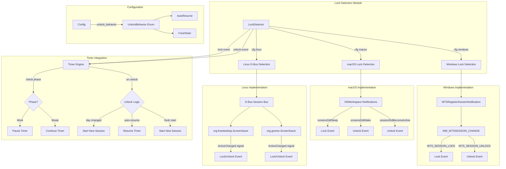

# Design Document: System Lock Detection

## Overview

This design implements cross-platform system lock/unlock detection for Pomohardo, enabling the timer to automatically pause during system lock and resume (or start fresh) upon unlock. The implementation uses platform-specific APIs and integrates with the existing Timer Engine to provide accurate time tracking.

**Current State:**
- Timer continues running when system is locked
- No detection of lock/unlock events
- Time tracking includes periods when user is away from computer

**Target State:**
- Automatic detection of system lock/unlock on Windows, macOS, and Linux
- Timer pauses during work sessions when system locks
- Timer continues during break sessions when system locks
- Configurable unlock behavior (auto-resume vs fresh start)
- Multi-day lock handling (fresh start on next day)
- Preservation of existing behavior for continuous running across midnight

## Architecture



## Components and Interfaces

### 1. LockDetector Module

New module for cross-platform lock detection:

```rust
pub struct LockDetector {
    #[cfg(target_os = "windows")]
    windows: Option<WindowsLockState>,
    #[cfg(target_os = "macos")]
    macos: Option<MacOSLockState>,
    #[cfg(target_os = "linux")]
    linux: Option<LinuxLockState>,
    lock_timestamp: Option<DateTime<Local>>,
    was_locked_on_startup: bool,
}

impl LockDetector {
    pub fn new() -> Self;
    pub fn start_monitoring(&mut self, callback: impl Fn(LockEvent) + Send + 'static) -> Result<(), String>;
    pub fn is_locked(&self) -> bool;
    pub fn get_lock_timestamp(&self) -> Option<DateTime<Local>>;
}

pub enum LockEvent {
    Locked,
    Unlocked,
}
```

### 2. Windows Lock Detection

**API Usage:**
- `WTSRegisterSessionNotification(hwnd, NOTIFY_FOR_THIS_SESSION)` - Register for session notifications
- `WM_WTSSESSION_CHANGE` message with `WTS_SESSION_LOCK` and `WTS_SESSION_UNLOCK` parameters
- `WTSQuerySessionInformation` - Query current lock state on startup

```rust
#[cfg(target_os = "windows")]
struct WindowsLockState {
    hwnd: HWND,
    registered: bool,
}
```

### 3. macOS Lock Detection

**API Usage:**
- `NSWorkspace.shared.notificationCenter` - Access notification center
- `NSWorkspace.screensDidSleepNotification` - Screen sleep (lock) notification
- `NSWorkspace.screensDidWakeNotification` - Screen wake notification  
- `NSWorkspace.sessionDidBecomeActiveNotification` - Session unlock notification
- `CGSessionCopyCurrentDictionary()` - Query current lock state

```rust
#[cfg(target_os = "macos")]
struct MacOSLockState {
    observer: *mut c_void, // NSNotificationCenter observer token
}
```

### 4. Linux Lock Detection

**API Usage:**
- D-Bus session bus connection
- `org.freedesktop.ScreenSaver` interface with `ActiveChanged` signal
- `org.gnome.ScreenSaver` interface (fallback for GNOME)
- `org.kde.screensaver` interface (fallback for KDE)
- Query current state via `GetActive()` method

```rust
#[cfg(target_os = "linux")]
struct LinuxLockState {
    connection: zbus::Connection,
    subscription: zbus::MatchRule,
}
```

### 5. Timer Engine Extensions

Add lock-aware state management:

```rust
pub struct TimerEngine {
    // ... existing fields ...
    locked: bool,
    lock_timestamp: Option<DateTime<Local>>,
    was_paused_before_lock: bool,
}

impl TimerEngine {
    pub fn handle_lock(&mut self);
    pub fn handle_unlock(&mut self, config: &Config) -> UnlockAction;
    fn is_day_boundary_crossed(&self) -> bool;
}

pub enum UnlockAction {
    Resume,
    StartNewSession,
    NoAction,
}
```

### 6. Configuration Extensions

Add unlock behavior preference:

```rust
#[derive(Debug, Clone, Serialize, Deserialize)]
pub enum UnlockBehavior {
    AutoResume,
    FreshStart,
}

impl Default for UnlockBehavior {
    fn default() -> Self {
        UnlockBehavior::AutoResume
    }
}

#[derive(Debug, Clone, Serialize, Deserialize)]
pub struct Config {
    // ... existing fields ...
    #[serde(default)]
    pub unlock_behavior: UnlockBehavior,
}
```

## Data Models

### LockDetector State

| Field | Type | Description |
|-------|------|-------------|
| lock_timestamp | Option<DateTime<Local>> | When the system was locked |
| was_locked_on_startup | bool | Whether system was already locked when app started |

### Timer Engine Lock State

| Field | Type | Description |
|-------|------|-------------|
| locked | bool | Whether system is currently locked |
| lock_timestamp | Option<DateTime<Local>> | When current lock occurred |
| was_paused_before_lock | bool | Whether timer was manually paused before lock |

### UnlockBehavior Configuration

| Variant | Description |
|---------|-------------|
| AutoResume | Resume timer from where it paused |
| FreshStart | Start a new work session |


## Correctness Properties

*A property is a characteristic or behavior that should hold true across all valid executions of a system-essentially, a formal statement about what the system should do. Properties serve as the bridge between human-readable specifications and machine-verifiable correctness guarantees.*

### Property 1: Work session pause on lock

*For any* running work session, when a system lock event occurs, the timer SHALL pause and preserve the current phase and remaining time.

**Validates: Requirements 1.2, 1.3, 2.2, 2.3, 3.2, 3.3**

### Property 2: Lock state persistence

*For any* timer state, while the system remains locked, the timer SHALL remain in the same paused state without time advancing.

**Validates: Requirements 1.5, 2.5, 3.5**

### Property 3: Configuration round-trip persistence

*For any* unlock behavior setting (AutoResume or FreshStart), saving the configuration and reloading it SHALL produce the same unlock behavior value.

**Validates: Requirements 4.2, 4.3, 4.5**

### Property 4: Lock duration exclusion

*For any* lock duration, when the timer resumes after unlock, the elapsed time during lock SHALL not be counted toward the session time.

**Validates: Requirements 5.4**

### Property 5: Break continuation during lock

*For any* active break session, when a system lock event occurs, the break timer SHALL continue running and counting down.

**Validates: Requirements 7.1, 7.4**

### Property 6: Day boundary detection

*For any* lock timestamp and unlock timestamp, if the dates differ, the system SHALL detect a day boundary crossing.

**Validates: Requirements 8.1**

### Property 7: Continuous running across midnight

*For any* running work session, when the date changes without a lock event, the session SHALL continue running without automatic reset.

**Validates: Requirements 9.1, 9.4**

### Property 8: Daily counter reset on date change

*For any* date change (with or without lock), the emergency skip counter and daily limit lock SHALL reset for the new day.

**Validates: Requirements 9.2, 9.3**

### Property 9: Session count preservation

*For any* fresh start unlock action, the session count and break debt SHALL be preserved from before the lock.

**Validates: Requirements 6.5**

### Property 10: Lock event emission

*For any* lock state change (locked or unlocked), the LockDetector SHALL emit a corresponding LockEvent.

**Validates: Requirements 10.4**

## Error Handling

### Windows Error Scenarios

| Error | Cause | Handling |
|-------|-------|----------|
| WTS registration failure | Insufficient permissions or invalid window handle | Log error, continue without lock detection |
| Session query failure | System API unavailable | Return false for is_locked(), log warning |

### macOS Error Scenarios

| Error | Cause | Handling |
|-------|-------|----------|
| Notification observer registration failure | System notification center unavailable | Log error, continue without lock detection |
| Session dictionary query failure | CGSession API unavailable | Return false for is_locked(), log warning |

### Linux Error Scenarios

| Error | Cause | Handling |
|-------|-------|----------|
| D-Bus connection failure | Session bus not available | Log error, continue without lock detection |
| ScreenSaver interface not found | Desktop environment doesn't support standard interface | Try fallback interfaces, log warning if all fail |
| Signal subscription failure | Permission or D-Bus configuration issue | Log error, continue without lock detection |

### General Error Handling Principles

1. **Graceful degradation**: If lock detection fails to initialize, the app continues functioning without it
2. **Logging**: All lock detection failures are logged for debugging
3. **No crashes**: Lock detection errors never crash the application
4. **Fallback behavior**: If lock detection is unavailable, timer behaves as it does currently (no auto-pause)

## Testing Strategy

### Dual Testing Approach

This implementation requires both unit tests and property-based tests:

- **Unit tests**: Verify specific platform behaviors, edge cases, and error conditions
- **Property-based tests**: Verify universal properties that should hold across all inputs

### Property-Based Testing Framework

**Framework**: `proptest` crate for Rust

**Configuration**: Each property test runs a minimum of 100 iterations.

### Property-Based Tests

Each property-based test MUST be tagged with: `**Feature: system-lock-detection, Property {number}: {property_text}**`

#### Test 1: Work session pause on lock
```rust
// **Feature: system-lock-detection, Property 1: Work session pause on lock**
proptest! {
    #[test]
    fn test_work_session_pauses_on_lock(
        remaining_seconds in 1..1500u32,
        session_count in 0..10u32
    ) {
        let config = Config::default();
        let mut timer = TimerEngine::new(config.clone());
        
        // Set up a running work session
        timer.start();
        // Simulate some time passing
        std::thread::sleep(Duration::from_secs(1));
        
        let state_before = timer.get_state();
        assert_eq!(state_before.phase, Phase::Work);
        assert_eq!(state_before.status, TimerStatus::Running);
        
        // Handle lock
        timer.handle_lock();
        
        let state_after = timer.get_state();
        assert_eq!(state_after.status, TimerStatus::Paused);
        assert_eq!(state_after.phase, Phase::Work);
        // Remaining time should be preserved (approximately)
        assert!((state_after.remaining_seconds as i32 - state_before.remaining_seconds as i32).abs() <= 1);
    }
}
```

#### Test 2: Lock duration exclusion
```rust
// **Feature: system-lock-detection, Property 4: Lock duration exclusion**
proptest! {
    #[test]
    fn test_lock_duration_not_counted(lock_duration_secs in 1..300u32) {
        let config = Config::default();
        let mut timer = TimerEngine::new(config.clone());
        
        timer.start();
        std::thread::sleep(Duration::from_secs(1));
        
        let remaining_before_lock = timer.get_state().remaining_seconds;
        
        // Lock
        timer.handle_lock();
        
        // Simulate time passing while locked
        std::thread::sleep(Duration::from_secs(lock_duration_secs as u64));
        
        // Unlock with auto-resume
        let mut config_resume = config.clone();
        config_resume.unlock_behavior = UnlockBehavior::AutoResume;
        timer.handle_unlock(&config_resume);
        
        let remaining_after_unlock = timer.get_state().remaining_seconds;
        
        // Remaining time should be approximately the same (within 1 second tolerance)
        assert!((remaining_after_unlock as i32 - remaining_before_lock as i32).abs() <= 1);
    }
}
```

#### Test 3: Break continuation during lock
```rust
// **Feature: system-lock-detection, Property 5: Break continuation during lock**
proptest! {
    #[test]
    fn test_break_continues_during_lock(lock_duration_secs in 1..60u32) {
        let config = Config::default();
        let mut timer = TimerEngine::new(config.clone());
        
        // Start and complete a work session to enter break
        timer.start();
        // Fast-forward to break (in real implementation, would use test helpers)
        timer.skip_work().unwrap();
        
        assert!(matches!(timer.get_state().phase, Phase::Break));
        
        let remaining_before_lock = timer.get_state().remaining_seconds;
        
        // Lock
        timer.handle_lock();
        
        // Simulate time passing while locked
        std::thread::sleep(Duration::from_secs(lock_duration_secs as u64));
        
        let remaining_during_lock = timer.get_state().remaining_seconds;
        
        // Break timer should have continued counting down
        assert!(remaining_during_lock < remaining_before_lock);
        assert!((remaining_before_lock - remaining_during_lock) >= lock_duration_secs - 1);
    }
}
```

#### Test 4: Configuration round-trip
```rust
// **Feature: system-lock-detection, Property 3: Configuration round-trip persistence**
proptest! {
    #[test]
    fn test_config_unlock_behavior_roundtrip(auto_resume: bool) {
        let mut config = Config::default();
        config.unlock_behavior = if auto_resume {
            UnlockBehavior::AutoResume
        } else {
            UnlockBehavior::FreshStart
        };
        
        // Save
        config.save().unwrap();
        
        // Load
        let loaded_config = Config::load().unwrap();
        
        // Should match
        assert_eq!(
            std::mem::discriminant(&config.unlock_behavior),
            std::mem::discriminant(&loaded_config.unlock_behavior)
        );
    }
}
```

### Unit Tests

#### Platform-Specific Tests

1. **Lock detection on startup**: Verify app detects if system is already locked when starting
2. **Manual pause before lock**: Verify manually paused timer stays paused after unlock
3. **Day boundary crossing**: Verify unlock after midnight starts fresh session
4. **Break completion during lock**: Verify break that completes while locked transitions correctly on unlock
5. **Fresh start mode**: Verify fresh start mode resets to new work session
6. **Session count preservation**: Verify session count and break debt preserved during fresh start

#### Error Handling Tests

1. **Lock detection initialization failure**: Verify graceful degradation
2. **Platform API unavailable**: Verify fallback behavior
3. **Invalid lock timestamps**: Verify handling of corrupted state

### Manual Testing Requirements

The following require manual verification on each platform:

1. Lock system and verify timer pauses (work session)
2. Lock system during break and verify timer continues
3. Lock overnight and verify fresh session starts on unlock
4. Configure auto-resume and verify timer resumes on unlock
5. Configure fresh start and verify new session starts on unlock
6. Manually pause, then lock, then unlock - verify stays paused
